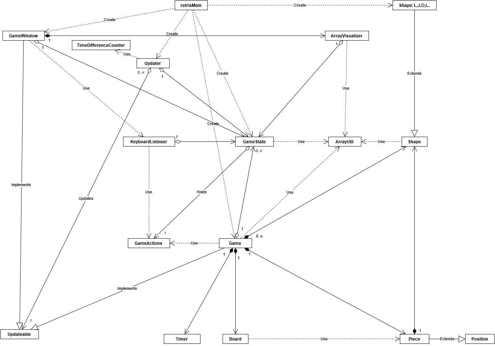

# retris
retris, eli siis perinteinen tetris peli ihan vaan huvinpitoon ja ajanvietteeseen.

- [Kurssisivu](https://github.com/javaLabra/Javalabra2015-1)
- [Kuvaus ja Rakenne](dokumentointi/aiheenKuvausJaRakenne.md)
- [Tuntikirjanpito](dokumentointi/tuntikirjanpito.md)
- [API](http://rochet2.github.io/retris/)

##GUI

##Luokkakaavio

