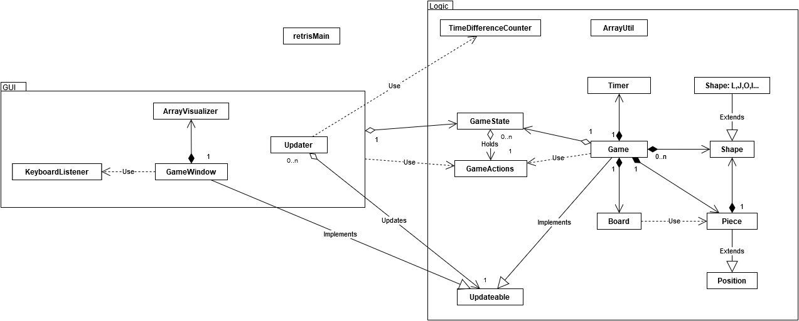

# retris
retris, eli siis perinteinen tetris peli ihan vaan huvinpitoon ja ajanvietteeseen.  
- [Kurssisivu](https://github.com/javaLabra/Javalabra2015-1)
- __[Download - lataa](https://github.com/Rochet2/retris/releases)__
- [Käyttöohje - guide](dokumentointi/Käyttöohje.md)
- [Kuvaus ja Rakenne](dokumentointi/aiheenKuvausJaRakenne.md)
- [Ohjelman rakenteen kuvaus](dokumentointi/Ohjelman rakenteen kuvaus.md)
- [Tuntikirjanpito](dokumentointi/tuntikirjanpito.md)
- [Testausdokumentaatio](dokumentointi/Testausdokumentaatio.md)
- [API](http://rochet2.github.io/retris/)

##GUI

##Luokkakaavio

