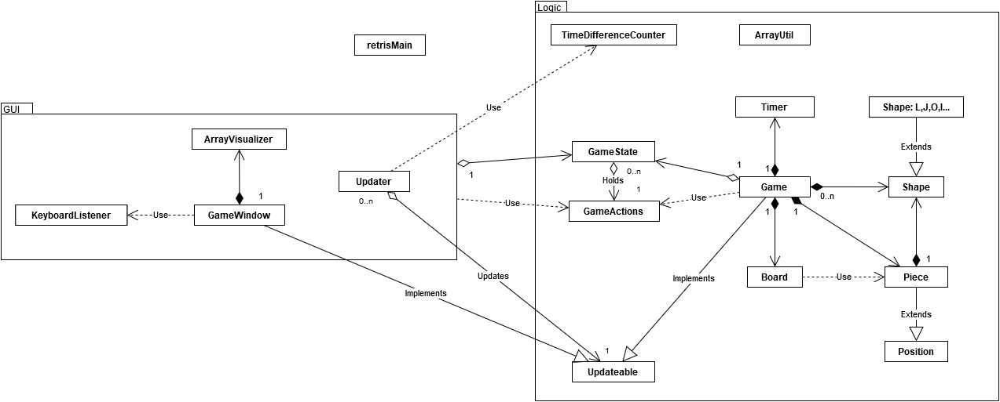

#Ohjelman rakenne
Retriksen main metodi retrisMain luokassa luo käyttöliittymän, peliolion (Game), pelin päivittäjän (Updater) ja GameState olion.
Tämän jälkeen oliot jatkavat itsenäisesti elämäänsä Updater olion päivittämänä.

Updater kutsuu GameWindow ja Game luokkien Update metodia jonka Updateable rajapinta tarjoaa.
Update metodi päivittää sitten käyttöliittymän tarvittaessa ja Game luokassa pelin tilanteen.
Game olio pitää sisällään pelin kulun kannalta oleelliset oliot ja hoitaa niiden kommunikoinnin. Game olio päivittelee GameState oliota jota UI sitten lukee ja näyttää pelaajalle.
Kaikki toiminta käyttöliittymän ja pelilogiikan välillä kulkee GameState olion kautta synkronoidusti jotta moniajo ongelmilta vältytään.

Käyttöliittymä siis tarkistelee GameState oliosta pelin tilannetta ja Game olio päivittelee tilannetta GameState olioon. Updater olio aiheuttaa nämä toiminnot.

Board on pelilauta joka pitää kirjaa vain pelilaudalla kiinteästi olevista paloista. Piece on tippuva pala ja Shape on sen muoto.
Game olio omaa listan eri muodoista jotka main metodi luo alussa ja joita sitten jaellaan Piece oliolle satunnaisesti.

Alla on kaksi luokkakaaviota.  
Toisessa on kaikki relaatiot luokkien välillä ja toisessa on selkeyden vuoksi jätetty pois osa vähemmän tärkeistä relaatioista.

###Kaikki relaatiot

###Tärkeimmät yhteydet

##Lisähuomio
Lisättävä on, että ohjelman rakenne on nykyisellään alkuperäistä monimutkaisempi. Sen aiheuttaa moniajovirheiden estämisen tuoma monimutkaisuus yhdessä single responsibility periaatteen kanssa. Tässä esimerkkinä vanha luokkakaavio ohjelman rakenteesta ennen isompia muutoksia, jotka mahdollistivat paremman oliotason rakenteen ja uusien toimintojen lisäämisen:  
https://raw.githubusercontent.com/Rochet2/retris/master/dokumentointi/JAVALABRA%20luokkakaavio%202.png
